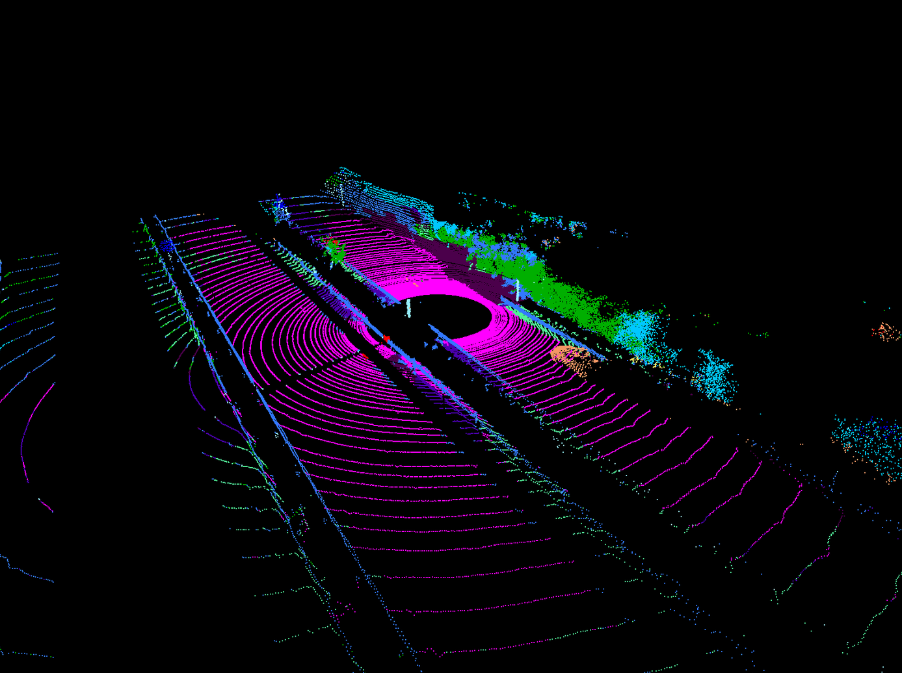

# SegSN

<p align="center"></p>

![License][license-image]
![Status][ci-macos-12]
![Status][ci-macos-13]
![Status][python-3.10]

[license-image]: https://img.shields.io/badge/license-MIT-green.svg?style=flat
[ci-macos-12]: https://img.shields.io/badge/macOS%20Monterey%2012-success-brightgreen
[ci-macos-13]: https://img.shields.io/badge/macOS%20Ventura%2013-success-brightgreen
[python-3.10]: https://img.shields.io/badge/python-3.10-blue

## Description
### General view
The SegSN project adapts the SalsaNext Deep Learning
Neural Network model for generic use. The [original project](https://github.com/TiagoCortinhal/SalsaNext) is intended
to be used with the [Semantic KITTI](http://semantic-kitti.org/dataset.html) datasets, and it is released with a 
pretrained model of the network.

In order to use this pretrained model with other data sources, the input scans
should be adapted to match the training datasets in terms of scan orientation,
channel ranges and brilliance (i.e. the intensity histogram).

### Process explanation
This project supports two data sources: KITTI and custom. The custom scans
must be stored in binary format, point after point, with coordinates 
in order `x, y, z, intensity` of type `float32`, in order to be used in 
the project. The steps are the following:
1. Load all scan file names (`.bin`) in a user given directory.
2. For each scan, reorient in Z axis if needed.
3. For each scan, adjust input field ranges. The input of the network
is a projected 5D image, and their ranges (minimum and maximum values)
must match those of the training dataset.
4. For each scan, adjust intensity histogram by applying an exponential 
factor to the input. If this factor is greater than 1.0, the scan gets darker, 
if it is smaller than 1.0, the scan gets lighter.
5. For each scan, compress intensity with respect to range. It has been 
observed that scans tend to be more "brilliant" in their farthest parts. To
compensate this effect, points whose range exceeds a given threshold are darkened.
6. Once the scan is properly adapted, its point-wise labels are inferred 
using the pretrained model. The results are those of the image above.
7. Predictions file is saved to disk with the same file name as the scan, 
with the extension `label`.
8. Ranges file is also saved to disk with the extension `.range`. It will be
used in future stages of the workflow.

### Results
The results are stored in the folders provided, in a 1-to-1 relation
between the input scans, labels files and ranges files. The resulting 
file structure is the following:
````
└── data
    ├── input_scans
    │   ├── scan_0000000000.bin
    │   ├── scan_0000000001.bin
    │   ├── ...
    │   └── scan_0000000xxx.bin
    ├── predictions
    │   ├── scan_0000000000.label
    │   ├── scan_0000000001.label
    │   ├── ...
    │   └── scan_0000000xxx.label
    └── ranges
        ├── scan_0000000000.range
        ├── scan_0000000001.range
        ├── ...
        └── scan_0000000xxx.range
````

## Execution
### Creating the environment
The following packages must be added to the Python environment:
- [PyYAML](https://pypi.org/project/PyYAML/) (~=6.0)
- [numpy](https://pypi.org/project/numpy/) (~=1.23.4)
- [tqdm](https://pypi.org/project/tqdm/) (~=4.64.1)
- [scipy](https://pypi.org/project/scipy/) (~=1.9.3)
- [torch](https://pypi.org/project/torch/) (~=1.12.1)
- [matplotlib](https://pypi.org/project/matplotlib/) (~=3.6.1)
- [Pillow](https://pypi.org/project/Pillow/) (~=9.2.0)

If you want to optimize the performance of the program, choose the appropriate version
of `torch` from the selector in the [official website](https://pytorch.org).

### Running the program
To execute this program, a minimal example dataset is provided.
1. Download the sample scans [here](https://drive.google.com/file/d/13AAwm010DBaOBkTGbZD9d-Dla1_Li-ws/view?usp=share_link) (1.17 GB).
2. Download the pretrained model [here](https://drive.google.com/file/d/15B9nd2dxjTXQpkkZqtlNE0HEFtvBRTMZ/view?usp=share_link) (95.4 MB) or from the original [SalsaNext]() project.
3. Unpack both zip files.
4. Run:
```
main.py 
    -d "path/to/scans/scans_lidar_frame"
    -w "path/to/scans/scans_world_frame"
    -o "path/to/predictions"
    -r "path/to/ranges"
    -m "path/to/pretrained"
    -s custom
    -p 2.2
```

When the previous command finishes, the paths set by `-o` and `-r` should 
contain the predictions and the ranges files, respectively. All the 
options available can be consulted by running `main.py --help`.